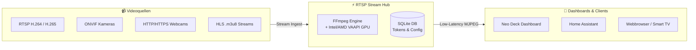

<div align="center">

# 🎥 RTSP Stream Hub

**High-Performance RTSP, ONVIF & Webcam Stream Hub with On-the-Fly MJPEG Transcoding & Hardware Acceleration**

[](https://github.com/Daddelgreis74/rtsp-stream-hub/releases)
[](https://hub.docker.com/r/daddelgreis74/rtsp-stream-hub)
[](https://hub.docker.com/r/daddelgreis74/rtsp-stream-hub)
[](https://apps.truenas.com)
[](https://opensource.org/licenses/MIT)

<p align="center">
  <a href="#-features">Features</a> •
  <a href="#-quick-start">Quick Start</a> •
  <a href="#-truenas-scale">TrueNAS SCALE</a> •
  <a href="#-configuration">Configuration</a> •
  <a href="#-api-reference">API Reference</a> •
  <a href="#-license">License</a>
</p>

</div>

---

## 📖 Overview

**RTSP Stream Hub** ist eine leichtgewichtige, autarke und vollständig dockerisierte Webanwendung zur Verwaltung und On-the-Fly-Transcodierung von RTSP- und Webcam-Kamerastreams in browserkompatibles **MJPEG**. 

Sie wurde speziell entwickelt, um moderne IP-Kameras (z. B. **Tapo, Reolink, Axis, Hikvision, Blink**) nahtlos, extrem latenzarm und ohne komplexe Streaming-Server-Infrastruktur in Webbrowser und SmartHome-Dashboards (wie **Neo Deck**, **Home Assistant** oder **MagicMirror**) einzubinden.



---

## ✨ Features

- 🔄 **Autarke RTSP-zu-MJPEG Transcodierung:** Nutzt eine optimierte, integrierte `ffmpeg`-Pipeline zur latenzarmen Konvertierung von RTSP (H.264/H.265) in flüssige MJPEG-Videoströme.
- 🌐 **Multi-Protokoll-Unterstützung:** Verarbeitet neben RTSP auch direkte HTTP/HTTPS-Webcams, HLS `.m3u8`-Livestreams und statische JPEG-Snapshots mit konfigurierbarem Auto-Refresh.
- ⚡ **GPU-Hardwarebeschleunigung (Intel/AMD VAAPI):** Automatische Erkennung und Nutzung von Intel-/AMD-Grafikeinheiten (`/dev/dri`) zur drastischen Entlastung der Host-CPU.
- 📡 **ONVIF Auto-Discovery:** Durchsucht das lokale Subnetz auf Knopfdruck nach kompatiblen IP-Kameras mit 1-Klick-Übernahme aller Stream-Profile.
- 👥 **Multi-User & Feingranulare Rechte:** Integriertes Admin-Panel zur Verwaltung von Benutzern mit getrennten Rollen (*Nur Ansehen*, *Kameras verwalten*, *Admin*).
- 🔒 **Sichere Dashboard-Tokens (Scoped Links):** Generiert minimale, dauerhafte Stream-Tokens (`role: 'stream-viewer'`), die strikt auf eine einzelne Kamera isoliert sind und keinerlei Rechte im Hub besitzen.
- ⏱️ **Auto-Logout nach Inaktivität:** Automatisches Abmelden der Administrationssitzung nach 15 Minuten Inaktivität zum Schutz der Endgeräte.
- 💾 **Transaktionssichere SQLite-Datenbank:** Speichert alle Konfigurationen dateibasiert und updatesicher in einem persistenten Volume.
- 🌓 **Modernes Bootstrap 5 UI:** Schnelles, responsives Webinterface mit umschaltbarem **Dark- & Light-Mode**.

---

## 🚀 Quick Start

### 1. Mit Docker Compose (Empfohlen)

> [!IMPORTANT]
> **Sicherheitsschlüssel erforderlich:**
> Die Umgebungsvariable `JWT_SECRET` muss mindestens **32 Zeichen** lang sein, andernfalls startet der Server zum Schutz deiner Kameras nicht.
> 
> Generiere einen Schlüssel im Terminal:
> ```bash
> openssl rand -hex 32
> # oder mit Node.js:
> node -e "console.log(require('crypto').randomBytes(32).toString('hex'))"
> ```

Erstelle eine Datei `docker-compose.yml`:

```yaml
services:
  rtsp-stream-hub:
    image: daddelgreis74/rtsp-stream-hub:latest # oder: ghcr.io/daddelgreis74/rtsp-stream-hub:latest
    container_name: rtsp-stream-hub
    restart: unless-stopped
    ports:
      - "8080:8080"
    volumes:
      - ./data:/usr/src/app/data
    devices:
      - /dev/dri:/dev/dri  # Optional: Für GPU-Hardwarebeschleunigung (Intel/AMD)
    environment:
      - PORT=8080
      - JWT_SECRET=dein_mindestens_32_zeichen_langer_geheimer_schluessel
      # - DISABLE_VAAPI=true # Optional: Setzen, falls keine GPU vorhanden ist / Fehler auftreten
```

Starte den Hub:
```bash
docker compose up -d
```

---

### 2. Mit Docker CLI

```bash
docker run -d \
  --name rtsp-stream-hub \
  --restart unless-stopped \
  -p 8080:8080 \
  -v $(pwd)/data:/usr/src/app/data \
  --device /dev/dri:/dev/dri \
  -e JWT_SECRET="dein_mindestens_32_zeichen_langer_geheimer_schluessel" \
  daddelgreis74/rtsp-stream-hub:latest
```

---

## 🎛️ TrueNAS SCALE

### Option A: Über den TrueNAS Community Catalog *(In Review)*
1. Navigiere in TrueNAS SCALE zu **Apps > Discover Apps**.
2. Suche nach **RTSP Stream Hub** und klicke auf **Install**.
3. Gib dein `JWT_SECRET` an und wähle deinen Speicherpfad.

### Option B: Als Custom App
1. Gehe zu **Apps > Discover Apps > Custom App**.
2. **Application Name:** `rtsp-stream-hub`
3. **Image Repository:** `daddelgreis74/rtsp-stream-hub` (oder `ghcr.io/daddelgreis74/rtsp-stream-hub`)
4. **Image Tag:** `latest` (oder z. B. `1.1.2`)
5. **Environment Variables:**
   - `JWT_SECRET`: *(Dein 32+ Zeichen langer Schlüssel)*
6. **Port Forwarding:** `8080` (Container) $\rightarrow$ `30474` (oder freier Host-Port).
7. **Storage:** Dataset auf Host mounten nach `/usr/src/app/data`.
8. **GPU Passthrough:** Haken bei *Non-NVIDIA GPU Passthrough* setzen.

---

## 🔐 Erstzugang & Standard-Login

Beim ersten Start wird automatisch ein initialer Administrator angelegt:

| Feld | Standardwert |
| :--- | :--- |
| **Benutzername** | `admin` |
| **Passwort** | `admin` |

> [!WARNING]
> Ändere das Passwort aus Sicherheitsgründen sofort nach dem ersten Login unter **Benutzerverwaltung**!

---

## ⚙️ Konfiguration (Environment Variables)

| Variable | Erforderlich | Standardwert | Beschreibung |
| :--- | :---: | :---: | :--- |
| `JWT_SECRET` | **JA** | — | Kryptografischer Schlüssel (mind. 32 Zeichen) zum Signieren aller Authentifizierungs- und Stream-Tokens. |
| `PORT` | Nein | `8080` | Interner Webserver-Port des Containers. |
| `DISABLE_VAAPI` | Nein | `false` | Auf `true` setzen, um GPU-Hardwarebeschleunigung vollständig zu deaktivieren (Software-FFmpeg). |

---

## 📡 REST API & Stream-Endpunkte

| Methode | Endpunkt | Berechtigung | Beschreibung |
| :--- | :--- | :--- | :--- |
| `POST` | `/api/auth/login` | Öffentlich | Authentifizierung & JWT-Token-Ausgabe |
| `GET` | `/api/cameras` | User / Admin | Liste aller gespeicherten Kameras abrufen |
| `POST` | `/api/cameras` | Editor / Admin | Neue Kamera anlegen |
| `PUT` | `/api/cameras/:id` | Editor / Admin | Bestehende Kamera aktualisieren |
| `DELETE` | `/api/cameras/:id` | Editor / Admin | Kamera entfernen |
| `GET` | `/api/cameras/discovery` | Editor / Admin | Startet ONVIF-Netzwerk-Suchlauf |
| `GET` | `/api/cameras/:id/token` | User / Admin | Erzeugt ein isoliertes, permanentes Stream-Token (`role: 'stream-viewer'`) |
| `GET` | `/api/streams/mjpeg/:id?token=...` | Stream-Viewer | Liefert den Live-MJPEG-Videostrom (`multipart/x-mixed-replace`) |
| `GET` | `/api/users` | Admin | Benutzerliste abrufen |
| `POST` | `/api/users` | Admin | Neuen Benutzer erstellen |
| `PUT` | `/api/users/:id/permissions` | Admin | Benutzerberechtigungen anpassen |
| `DELETE` | `/api/users/:id` | Admin | Benutzerkonto löschen |

---

## 🛡️ Sicherheit & Scoped Tokens

RTSP Stream Hub trennt strikt zwischen **Administrations-Tokens** und **Stream-Tokens**:
- **Dashboard-Stream-Links** enthalten ein signiertes Token, das ausschließlich für den Endpunkt `/api/streams/mjpeg/:id` gültig ist.
- Selbst wenn ein Token im Webinterface deines Dashboards (z. B. im HTML-Source) einsehbar ist, kann ein Angreifer damit weder andere Kameras einsehen noch Einstellungen oder Benutzer verändern.

---

## 📄 Lizenz

Dieses Projekt steht unter der [MIT Lizenz](LICENSE).  
Copyright (c) 2026 **Daddelgreis74**.
