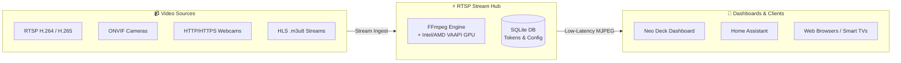

<div align="center">


# 🎥 RTSP Stream Hub

**High-Performance RTSP, ONVIF & Webcam Stream Hub with On-the-Fly MJPEG Transcoding, Stream Multiplexing & Hardware Acceleration**

[](https://github.com/Daddelgreis74/rtsp-stream-hub/releases)
[](https://hub.docker.com/r/daddelgreis74/rtsp-stream-hub)
[](https://hub.docker.com/r/daddelgreis74/rtsp-stream-hub)
[](https://apps.truenas.com)
[](https://opensource.org/licenses/MIT)

<p align="center">
  <a href="#-overview">Overview</a> •
  <a href="#-features">Features</a> •
  <a href="#-quick-start">Quick Start</a> •
  <a href="#-truenas-scale">TrueNAS SCALE</a> •
  <a href="#-configuration">Configuration</a> •
  <a href="#-api-reference">API Reference</a> •
  <a href="#-security--scoped-tokens">Security</a> •
  <a href="#-license">License</a>
</p>

</div>

---

## 📖 Overview

**RTSP Stream Hub** is a lightweight, standalone, fully containerized web application designed for managing and on-the-fly transcoding of RTSP camera streams and webcams into browser-compatible **MJPEG**.

It is specifically tailored to integrate IP cameras (e.g., **Tapo, Reolink, Axis, Hikvision, Blink**) seamlessly, with ultra-low latency and zero complex streaming server infrastructure, into web browsers and SmartHome dashboards (such as **Neo Deck**, **Home Assistant**, or **MagicMirror**).



---

## ✨ Features

- 🔄 **Self-Contained RTSP-to-MJPEG Transcoding:** Uses an optimized, integrated `ffmpeg` pipeline for real-time, low-latency conversion of RTSP (H.264/H.265) streams into smooth MJPEG video feeds.
- 🌐 **Multi-Protocol Support:** Handles RTSP, direct HTTP/HTTPS webcams, HLS `.m3u8` live streams, and static JPEG snapshots with configurable auto-refresh intervals.
- ⚡ **GPU Hardware Acceleration (Intel/AMD VAAPI):** Automatically detects and utilizes Intel/AMD graphics cards (`/dev/dri`) to dramatically reduce host CPU load.
- 📡 **ONVIF Auto-Discovery:** Scans the local subnet for compatible IP cameras at the push of a button with 1-click profile import.
- 👥 **Multi-User & Granular Permissions:** Built-in administration panel for managing users with distinct permission roles (*View Only*, *Manage Cameras*, *Admin*).
- 🔒 **Secure Dashboard Tokens (Scoped Links):** Generates minimal, persistent stream tokens (`role: 'stream-viewer'`) strictly isolated to a single camera with zero administrative access.
- ⏱️ **Inactivity Auto-Logout:** Automatically logs out administrative sessions after 15 minutes of inactivity to protect client devices and conserve server resources.
- 💾 **Persistent SQLite Database:** File-based, transaction-safe storage for all camera configurations and user accounts within a mounted volume.
- 🌓 **Modern Bootstrap 5 UI:** Fast, responsive web interface with instant **Dark & Light Mode** switching.

---

## 🚀 Quick Start

### 1. Using Docker Compose (Recommended)

> [!IMPORTANT]
> **Secret Key Required:**
> The `JWT_SECRET` environment variable is **mandatory** and must be at least **32 characters** long. The server will safely refuse to start without a strong secret key.
> 
> Generate a secure secret in your terminal:
> ```bash
> openssl rand -hex 32
> # or using Node.js:
> node -e "console.log(require('crypto').randomBytes(32).toString('hex'))"
> ```

Create a `docker-compose.yml` file:

```yaml
services:
  rtsp-stream-hub:
    image: daddelgreis74/rtsp-stream-hub:latest # or: ghcr.io/daddelgreis74/rtsp-stream-hub:latest
    container_name: rtsp-stream-hub
    restart: unless-stopped
    ports:
      - "8080:8080"
    volumes:
      - ./data:/usr/src/app/data
    devices:
      - /dev/dri:/dev/dri  # Optional: For Intel/AMD GPU hardware acceleration
    environment:
      - PORT=8080
      - JWT_SECRET=your_at_least_32_character_long_secret_key
      # - DISABLE_VAAPI=true # Optional: Set to true to disable GPU acceleration
```

Start the application:
```bash
docker compose up -d
```

---

### 2. Using Docker CLI

```bash
docker run -d \
  --name rtsp-stream-hub \
  --restart unless-stopped \
  -p 8080:8080 \
  -v $(pwd)/data:/usr/src/app/data \
  --device /dev/dri:/dev/dri \
  -e JWT_SECRET="your_at_least_32_character_long_secret_key" \
  daddelgreis74/rtsp-stream-hub:latest
```

---

## 🎛️ TrueNAS SCALE

### Option A: Via TrueNAS Community Catalog *(In Review)*
1. In TrueNAS SCALE, navigate to **Apps > Discover Apps**.
2. Search for **RTSP Stream Hub** and click **Install**.
3. Provide your `JWT_SECRET` and select your dataset storage path.

### Option B: As a Custom App
1. Go to **Apps > Discover Apps > Custom App**.
2. **Application Name:** `rtsp-stream-hub`
3. **Image Repository:** `daddelgreis74/rtsp-stream-hub` (or `ghcr.io/daddelgreis74/rtsp-stream-hub`)
4. **Image Tag:** `latest` (or e.g., `1.1.2`)
5. **Environment Variables:**
   - `JWT_SECRET`: *(Your 32+ character secret key)*
6. **Port Forwarding:** `8080` (Container) $\rightarrow$ `30474` (or any available host port).
7. **Storage:** Mount host dataset to `/usr/src/app/data`.
8. **GPU Passthrough:** Check *Non-NVIDIA GPU Passthrough* (1 GPU).

---

## 🔐 Default Credentials

On initial startup, an administrator account is automatically created:

| Field | Default Value |
| :--- | :--- |
| **Username** | `admin` |
| **Password** | `admin` |

> [!WARNING]
> Please change the default password immediately after your first login under the **User Management** menu!

---

## ⚙️ Configuration (Environment Variables)

| Variable | Required | Default | Description |
| :--- | :---: | :---: | :--- |
| `JWT_SECRET` | **YES** | — | Cryptographic secret (min. 32 chars) for signing authentication and scoped stream tokens. |
| `PORT` | No | `8080` | Internal web server port. |
| `DISABLE_VAAPI` | No | `false` | Set to `true` to disable GPU hardware acceleration and force software decoding. |

---

## 📡 REST API & Stream Endpoints

| Method | Endpoint | Authorization | Description |
| :--- | :--- | :--- | :--- |
| `POST` | `/api/auth/login` | Public | Authenticate and obtain JWT token |
| `GET` | `/api/cameras` | User / Admin | Retrieve list of configured cameras |
| `POST` | `/api/cameras` | Editor / Admin | Add a new camera configuration |
| `PUT` | `/api/cameras/:id` | Editor / Admin | Update an existing camera |
| `DELETE` | `/api/cameras/:id` | Editor / Admin | Delete a camera |
| `GET` | `/api/cameras/discovery` | Editor / Admin | Trigger ONVIF network auto-discovery scan |
| `GET` | `/api/cameras/:id/token` | User / Admin | Generate an isolated, persistent stream token (`role: 'stream-viewer'`) |
| `GET` | `/api/streams/mjpeg/:id?token=...` | Stream-Viewer | Live MJPEG multipart video stream (`multipart/x-mixed-replace`) |
| `GET` | `/api/users` | Admin | List all user accounts |
| `POST` | `/api/users` | Admin | Create a new user account |
| `PUT` | `/api/users/:id/permissions` | Admin | Update user roles and permissions |
| `DELETE` | `/api/users/:id` | Admin | Delete a user account |

---

## 🛡️ Security & Scoped Tokens

RTSP Stream Hub maintains a strict security boundary between **Administrative Tokens** and **Stream Tokens**:
- **Dashboard Stream Links** contain a cryptographically signed token that is valid exclusively for the `/api/streams/mjpeg/:id` endpoint of that specific camera.
- Even if a stream URL is exposed in dashboard frontend code or browser HTML sources, an unauthorized viewer cannot access administrative endpoints, modify settings, or view other cameras.

---

## 📄 License

This project is licensed under the [MIT License](LICENSE).  
Copyright (c) 2026 **Daddelgreis74**.
